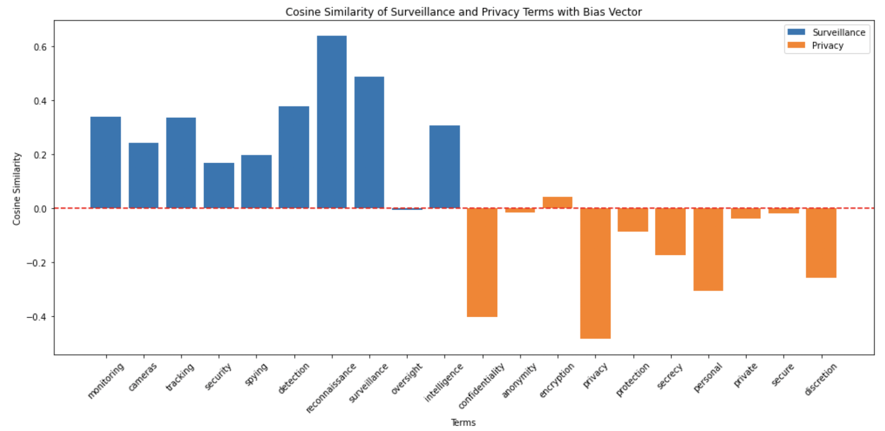

# Understanding and Mitigating Bias in Cybersecurity Data Science

## Executive Summary

Addressing bias in cybersecurity is essential to ensure effective threat detection, efficient resource allocation, and maintaining user trust. Bias in cybersecurity can originate from historical data, algorithmic design, or human judgment, leading to compromised security measures, inefficient use of resources, and damaged organizational reputation. Data scientists play a critical role in identifying and mitigating these biases through diverse and representative data collection, fairness-aware algorithms, and continuous model evaluation. This report outlines the importance of addressing bias in cybersecurity and provides a detailed summary of a project on operations with word vectors, highlighting its accomplishments and relevance to mitigating bias.

*Figure 1: Surveillance privacy bias vector - This image illustrates the surveillance privacy bias vector and how serveillance related terms in blue tend to be above the line and privacy related terms in orange tend to be below the line.*

### 5.2 Name Bias Neutralization

*Figure 2: Name bias neutralization - The before image on the left illustrates the impact of bias in surveillance systems, highlighting how certain demographics may be disproportionately targeted or overlooked, leading to privacy concerns and unfair treatment.  The after image on the right demonstrates how techniques to neutralize bias associated with names in datasets, can level the playing field.*

## Table of Contents
1. [Introduction](#1-introduction)
   - [1.1 Definition of Bias in Cybersecurity](#11-definition-of-bias-in-cybersecurity)
   - [1.2 Importance of Addressing Bias](#12-importance-of-addressing-bias)
2. [Why Bias is Important to Cybersecurity](#2-why-bias-is-important-to-cybersecurity)
   - [2.1 Impact on Threat Detection](#21-impact-on-threat-detection)
   - [2.2 Resource Allocation and Efficiency](#22-resource-allocation-and-efficiency)
   - [2.3 User Trust and Organizational Reputation](#23-user-trust-and-organizational-reputation)
3. [Why Bias is Important to Cybersecurity Data Science](#3-why-bias-is-important-to-cybersecurity-data-science)
   - [3.1 Role of Data Scientists in Cybersecurity](#31-role-of-data-scientists-in-cybersecurity)
   - [3.2 Consequences of Biased Data and Models](#32-consequences-of-biased-data-and-models)
   - [3.3 Ethical and Regulatory Compliance](#33-ethical-and-regulatory-compliance)
4. [Summary of Project Accomplishments](#4-summary-of-project-accomplishments)
   - [4.1 Explanation of Word Embeddings](#41-explanation-of-word-embeddings)
   - [4.2 Loading Pre-trained Word Vectors](#42-loading-pre-trained-word-vectors)
   - [4.3 Measuring Similarity Between Word Vectors](#43-measuring-similarity-between-word-vectors)
   - [4.4 Solving Word Analogy Problems](#44-solving-word-analogy-problems)
   - [4.5 Reducing Surveillance / Privacy Bias](#45-optional-exercise-on-reducing-gender-bias)
5. [Conclusion](#5-conclusion)
   - [5.1 Summary of Key Points](#51-summary-of-key-points)
   - [5.2 Importance of Ongoing Efforts to Address Bias](#52-importance-of-ongoing-efforts-to-address-bias)
   - [5.3 Call to Action for Data Scientists and Cybersecurity Professionals](#53-call-to-action-for-data-scientists-and-cybersecurity-professionals)
6. [References](#6-references)

## 1. Introduction

### 1.1 Definition of Bias in Cybersecurity

Bias in cybersecurity refers to the systematic deviation from neutrality in threat detection, response, and prevention measures. It can manifest in various forms, including the preferential treatment of certain types of threats over others, or the unequal treatment of different user groups based on characteristics such as ethnicity, gender, or geographical location. Bias can originate from historical data, algorithmic design, or human judgment, and it has significant implications for the effectiveness and fairness of cybersecurity practices.

### 1.2 Importance of Addressing Bias

Addressing bias in cybersecurity is crucial for several reasons. First, bias can compromise the effectiveness of security measures by causing false positives or false negatives, leading to missed threats or unnecessary alarms. Second, biased security practices can lead to the inefficient allocation of resources, focusing efforts on less relevant threats while neglecting more critical issues. Finally, bias can undermine user trust and damage the reputation of organizations, particularly if security measures are perceived as unfair or discriminatory.

## 2. Why Bias is Important to Cybersecurity

### 2.1 Impact on Threat Detection

Bias in threat detection can result in significant security vulnerabilities. When detection systems are biased, they may generate false positives (incorrectly identifying benign activity as malicious) or false negatives (failing to identify actual threats). This imbalance can lead to inadequate threat coverage, leaving organizations exposed to undetected attacks or overwhelmed by false alarms.

### 2.2 Resource Allocation and Efficiency

Effective cybersecurity requires the optimal use of limited resources. Biased threat detection systems can misallocate these resources by directing attention and effort toward less critical threats while ignoring more significant risks. This misallocation not only wastes resources but also increases the likelihood of successful attacks due to overlooked vulnerabilities.

### 2.3 User Trust and Organizational Reputation

Trust is a cornerstone of cybersecurity. When users perceive security measures as biased or unfair, their trust in the organization can erode. This erosion of trust can lead to decreased compliance with security protocols and a higher likelihood of security breaches. Additionally, biased security practices can harm an organization's reputation, making it more difficult to attract and retain customers.

## 3. Why Bias is Important to Cybersecurity Data Science

### 3.1 Role of Data Scientists in Cybersecurity

Data scientists play a critical role in cybersecurity by developing models that detect and predict threats, analyzing data to uncover insights, and creating algorithms that automate security processes. Their work is essential for enhancing the efficiency and effectiveness of cybersecurity measures.

### 3.2 Consequences of Biased Data and Models

When data scientists use biased data or develop biased models, the consequences can be severe. Biased data can skew security measures, making them less effective at detecting and preventing threats. For example, if historical data overrepresents certain types of attacks, models trained on this data may prioritize these attacks while neglecting emerging threats. Similarly, biased models can produce inaccurate threat predictions, leading to inadequate security responses.

### 3.3 Ethical and Regulatory Compliance

Ethical and regulatory considerations are increasingly important in cybersecurity. Data scientists must ensure that their models comply with legal requirements and ethical standards. This includes avoiding discrimination and ensuring fairness in threat detection and response. Failure to address bias can result in legal penalties, loss of customer trust, and reputational damage.

## 4. Summary of Project Accomplishments

### 4.1 Explanation of Word Embeddings

The project began with a detailed explanation of how word embeddings capture relationships between words. This foundational knowledge is crucial for understanding the subsequent tasks.

### 4.2 Loading Pre-trained Word Vectors

Pre-trained word vectors were successfully loaded, demonstrating the ability to leverage existing embeddings without the need for extensive computational resources to train new ones.

### 4.3 Measuring Similarity Between Word Vectors

Using cosine similarity, the project measured the similarity between different word vectors. This task highlighted the importance of understanding the contextual relationships between words in a given corpus.

### 4.4 Solving Word Analogy Problems

The project applied word embeddings to solve analogy problems, exemplifying the practical use of embeddings in tasks such as "Man is to Woman as King is to __."

### 4.5 Reducing Surveillance / Privacy Bias

An optional exercise was provided to modify word embeddings to reduce gender bias. This task emphasized the significance of addressing bias in machine learning models, aligning with broader ethical considerations in data science.

These accomplishments underscore the importance of pre-trained word vectors in natural language processing tasks and provide a practical framework for their application in cybersecurity data science to improve the detection and mitigation of biased threats.

## 5. Conclusion

### 5.1 Summary of Key Points

Addressing bias in cybersecurity is critical for enhancing threat detection, optimizing resource allocation, and maintaining user trust. Data scientists play a vital role in this process by developing models that are free from bias and ensuring that security measures are fair and effective.

### 5.2 Importance of Ongoing Efforts to Address Bias

Bias in cybersecurity is an ongoing challenge that requires continuous effort to address. Data scientists, cybersecurity professionals, and organizational leaders must work together to identify and mitigate bias, ensuring that security measures are equitable and effective.

### 5.3 Call to Action for Data Scientists and Cybersecurity Professionals

Data scientists and cybersecurity professionals must remain vigilant in their efforts to detect and address bias. By adopting best practices, leveraging fairness-aware algorithms, and continuously monitoring model performance, they can help create a more secure and fair digital environment.

## 6. References

- **Academic Papers and Articles**:
  - [Bolukbasi et al., 2016, Man is to Computer Programmer as Woman is to Homemaker? Debiasing Word Embeddings](https://arxiv.org/abs/1607.06520)
  - [Jeffrey Pennington, Richard Socher, and Christopher D. Manning](https://nlp.stanford.edu/projects)
- **Industry Reports and Guidelines**: [List relevant industry reports and guidelines]
- **Case Studies and Examples**: [Include any relevant case studies and examples]

